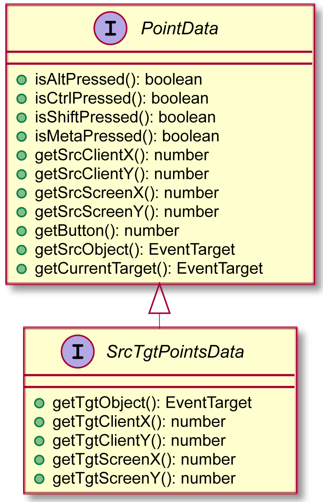

## How to select a user interaction

```ts
clickBinder()
  ...
  .bind();
```
The user interaction selection is the goal of the first binding routine. For each user interaction provided by Interacto,
a dedicated routine exists. Here `clickBinder()` for a click interaction.

Routines for standard user interactions:
`buttonBinder, checkboxBinder, colorPickerBinder, comboBoxBinder, spinnerBinder, dateBinder, hyperlinkBinder, textInputBinder`

Routines for standard mouse-based interactions:
`clickBinder, dbleClickBinder, pressBinder, scrollBinder, dndBinder, dragLockBinder`

Some of these routines will be covered in the following sections.

## Pressure, Click, Double-click

```ts
pressBinder()
    ...
    .bind();
```

The `press` interaction refers to a single pressure on a mouse button.

```ts
clickBinder()
    ...
    .bind();
```

The `click` interaction refers to a single mouse click. For touch devices, see the `tap` interaction.

```ts
dbleClickBinder()
    ...
    .bind();
```

The `double click` interaction refers to double click made using a mouse.
Moving between the two clicks cancels the interaction
There is a maximal duration between the two clicks. By default this duration is 300 ms but one can change it.
For touch devices, see the `tap` interaction.

## DnD, Draglock

```ts
dndBinder(true)
    ...
    .bind();
```

The DnD refers to a Drag-And-Drop interaction.
This DnD does not aim at dragging an object from a place to another one. The DnD is the sequence of a mouse pressure, followed by a set of mouse moves (at least one), that ends with a mouse release.
This is up to the developer to decide what to do using the DnD.

The DnD takes one boolean argument: is the DnD cancellable (`true`) or not (`false`)? To cancel a DnD, press the key `escape`.

```ts
dragLockBinder()
    ...
    .bind();
```

The drag-lock interaction is a special kind of DnD.
A drag-lock starts by double-clicking on a source node. The user can then move the locked node until she double-clicks again at the dropping location.
To cancel a drag-lock, press the key `escape`.

Using these two interactions, the variable `i` in the routines (the interaction data) is of type `SrcTgtPointsData`.


<div style="width: 300px; margin-left: auto; margin-right: auto">
    
</div>

The documentation of this interface is defined [here](https://interacto.github.io/docs/interfaces/srctgtpointsdata.html).

## Keyboard interactions and the `with` routine

```ts
keyTypeBinder(false)
    .with('KeyC')
    ...
    .bind();
```

Keyboard interactions have a specific (optional) routine `with`.
In the example, the binding operates only if the `c` key is used. This refers to the `code` of the keyboard event.

The interaction `key type` refers to a key typing.

```ts
keysTypeBinder()
    .with('KeyC', 'KeyL', 'KeyE', 'KeyA', 'KeyR')
    ...
    .bind();
```

You can define several codes in the with routine. In this example the user have to type the keys 'c' 'l' 'e' 'a' 'r'
(in any order) to produce the command.

The `keys type` interaction refers to a sequence of key typed that ends after a delay of 1 second: if 1 second elapses
after the last key typing, the interaction ends. This permits to write a sequence and to then execute a command.

```ts
keyPressBinder(false)
...
.bind();
```

The key press interaction refers to a pressure of a key. This interaction takes one boolean argument:
does the interaction have to capture key modifier events (true).
