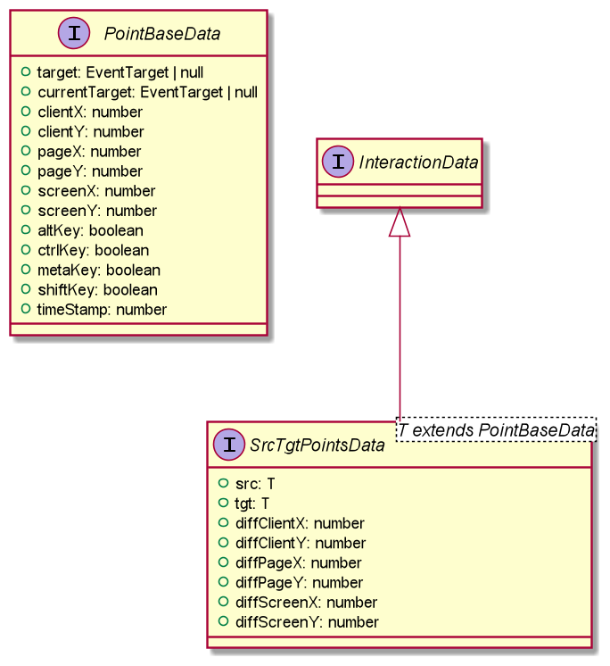
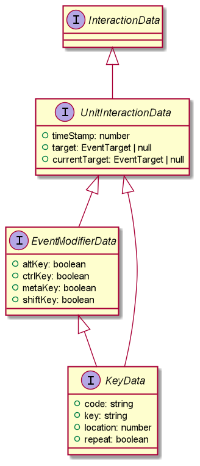

Interacto supports a wide range of user interactions, whether they involve keyboard, mouse or touchscreen events.

## How to select a user interaction

The first [routine](./routines) in the binding configuration process allows you to select a user interaction.
For each user interaction provided by Interacto, a dedicated routine exists.
For example, `clickBinder()` to use a click interaction for the binding:

```ts
clickBinder()
  ...
  .bind();
```

Routines for standard user interactions:
`buttonBinder, checkboxBinder, colorPickerBinder, comboBoxBinder, spinnerBinder, dateBinder,
hyperlinkBinder, textInputBinder`.

Routines for standard mouse-based interactions:
`clickBinder, dbleClickBinder, pressBinder, scrollBinder, dndBinder, dragLockBinder,
mousemoveBinder, mouseoutBinder, mouseoverBinder`.

Some of these routines will be covered in the following sections.

## Press, click, double-click

The `press` interaction refers to a single pressure on a mouse button.

```ts
pressBinder()
    ...
    .bind();
```

The `click` interaction refers to a single mouse click, defined as a mouse button pressure followed by a release.
For touch devices, see the `tap` interaction.

```ts
clickBinder()
    ...
    .bind();
```

The `double click` interaction refers to a double click made using a mouse.
Moving the mouse between the two clicks cancels the interaction.
There is a maximal duration between the two clicks. By default, this duration is 300 ms but can be changed.
For touch devices, see the `tap` interaction.

```ts
dbleClickBinder()
    ...
    .bind();
```

## Mouse over, mouse out, mouse moves

The `mouse over` interaction refers to the mouse cursor entering an element.
It accepts a boolean argument, `withBubbling`.

If set to false, the binding will listen for the mouseenter Mouse Event, that has event bubbling disabled.
This means that the command will be executed once when the mouse cursor enters the targeted element.
This is the more conventional behaviour.

If set to true, the binding will listen for the mouseover Mouse Event, that has bubbling enabled.
This means that the command will be executed when the mouse cursor enters the targeted element **and** when it enters any of its children.
This can result in the command being executed several times in rapid succession when the cursor enters an element that has many children.

To learn more about the difference between those mouse events, check out the 
[mouseenter](https://developer.mozilla.org/fr/docs/Web/API/Element/mouseenter_event) documentation.


```ts
mouseoverBinder(true)
    ...
    .bind();
```

The `mouse out` interaction refers to the mouse cursor leaving an element.
It also accepts the `withBubbling` argument.
If set to false, the binding will listen for the mouseleave Mouse Event with bubbling disabled, and
if set to true it will listen for the mouseout Mouse Event with bubbling enabled.

```ts
mouseoutBinder(true)
    ...
    .bind();
```

The `mouse moves` interaction refers to the mouse cursor moving over an element and any of its children.

```ts
mousemoveBinder()
    ...
    .bind();
```

## DnD, Draglock

The DnD refers to a Drag-And-Drop interaction.
Note that the goal of the DnD is not to drag an element from a place to another.
A DnD is a sequence composed of a mouse button pressure, followed by a set of mouse movements(at least one),
that ends with a mouse button release.
It is up to the developer to decide what to do using the DnD: it could be used to move elements,
but also for totally different purposes.

The DnD takes one boolean argument: is the DnD cancellable (`true`) or not (`false`)? To cancel a DnD, press the `escape` key.

```ts
dndBinder(true)
    ...
    .bind();
```

The drag-lock interaction is a special kind of DnD.
A drag-lock starts by double-clicking on a source node.
The user can then move the locked node until they double-click again at the dropping location.
To cancel a drag-lock, press the `escape` key.

```ts
dragLockBinder()
    ...
    .bind();
```

Using these two interactions, the `i` argument in the routines 
(the [interaction data](./routines#what-are-i-and-c-in-binding-routines)) is of type `SrcTgtPointsData`.
This means you can access the node the DnD or drag-lock started on using `i.src.tgt`, and the node the user is
currently hovering or finished the interaction on using `i.target.tgt`.

<div style="width: 500px; margin-left: auto; margin-right: auto">
    
</div>

The documentation of this interface is defined [here](https://interacto.github.io/ts-docs/interfaces/srctgtpointsdata.html).

## Keyboard interactions and the `with` routine

### The `key type` and `key press` interactions

Keyboard interactions have a specific (optional) `with` routine. The argument passed to `with` refers to the `code`
property of the underlying `KeyboardEvent` and identifies the key that must be pressed to start the interaction.
In this example, the binding operates only if the `c` key is used. If we wanted to allow any key, we could have
simply omitted the `with` routine.

```ts
keyTypeBinder()
    .on(window.document.body)
    .with(false, 'c')
    ...
    .bind();
```

The first argument for `with` specifies whether the strings specified correspond to key values, or to key codes.
If true, the strings are considered to be key codes.
Key codes, unlike key values, don't take into account the user's actual keyboard layout. Both the "Q" key on QWERTY
keyboards and the "A" key on AZERTY keyboards have the same "KeyQ" key code, because they share the same physical position
on a keyboard. When using key values on the other hand, a key marked "Q" will return "q" and a key marked "A" will return "a",
regardless of the keyboard layout. Refer to the [KeyboardEvent](https://developer.mozilla.org/en-US/docs/Web/API/KeyboardEvent) 
documentation for more information on the difference between the two.

`.on(window.document.body)` allows us to specify that we want the keyboard event to be captured at the highest level
in the page hierarchy, in order to be sure to not miss it. Keyboard events are triggered on the currently selected element,
which means that if your interaction is not configured to target the right one, you might miss them.
But thanks to [event bubbling](https://developer.mozilla.org/fr/docs/Learn/JavaScript/Building_blocks/Events#Event_bubbling_and_capture), 
events are also transmitted to the source element's parent and to their parent's parent, until they reach the highest level at the root
of the document. If we want to capture the key press no matter which element was selected by the user,
this will ensure that we get the expected behaviour.

The `key type` interaction corresponds to the user pressing, then releasing a single key. The similar `key press` interaction
corresponds to the user pressing a key and triggers the command without waiting for the key to be released.

The `key press` interaction takes one boolean argument, indicating if the interaction should accept
events that use modifier keys, such as `ctrl`, `shift`, `alt`, or `meta` (Windows/Command on Mac).
If this is set to false, then the interaction will not start as long as one of these keys is pressed.

```ts
keyPressBinder(false)
    .on(window.document.body)
    ...
    .bind();
```

When using one of these two interactions, the  interaction data `i` is of type `KeyData`.
You can access the identifier of the key that has been pressed/typed with `i.key`.

<div style="width: 250px; margin-left: auto; margin-right: auto">
    
</div>

### The `keys type` and `keys press` interactions

Using the `keys type` interaction, you can define several codes in the `with` routine.
In the following example the user has to type the keys 'c', 'l', 'e', 'a' and 'r'
(in any order) to produce the command.

```ts
keysTypeBinder()
    .on(window.document.body)
    .with(true, 'KeyC', 'KeyL', 'KeyE', 'KeyA', 'KeyR')
    ...
    .bind();
```

The `keys type` interaction corresponds to a sequence of `key type` interactions that ends after a delay of 1 second:
if 1 second elapses after a key is released for the last time, the interaction ends. 
This allows waiting for a sequence of keys and then executing a command.

A corresponding `keys press` interaction also exists.

