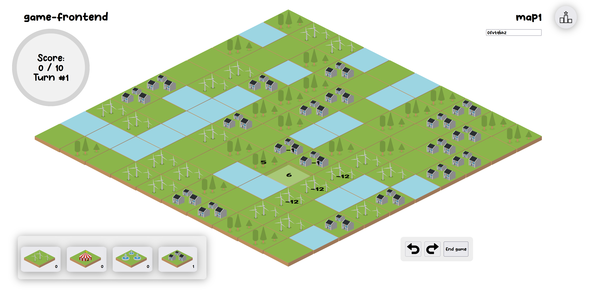
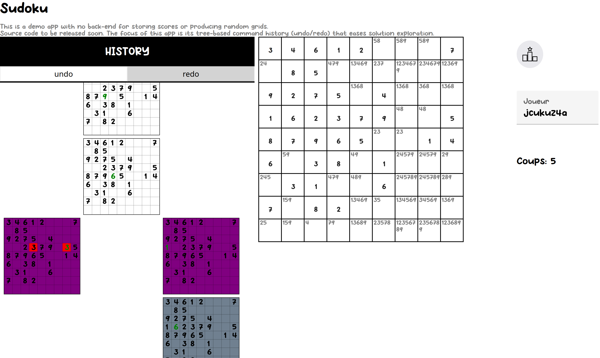

## Gallery

You can play with the two follow games (click on a picture to open the game) to observe the potency of Interacto for developing user interfaces and use complex command histories (for undo/redo).

 

## With TypeScript

### Demonstration apps

We developed an [Angular app](https://github.com/interacto/example-angular) to illustrate the different features.
[Vue.js](https://github.com/interacto/example-vuejs)
and [React](https://github.com/interacto/example-react)
versions are also available.

### Stack Overflow questions

In this
[stackoverflow question](https://stackoverflow.com/questions/62237719/implementing-undo-and-redo-in-canvas-whiteboard-using-typescript/64563793),
we show how to create two undoable commands (to add and erase shapes), and how to use them on an HTML canvas in an Angular app.

## With JavaFX

### LaTeXDraw

[LaTeXDraw](https://github.com/latexdraw/latexdraw) is a vector drawing editor for LaTeX.

### Spoon Visualisation

[Spoon Visualisation](https://github.com/INRIA/spoon/tree/master/spoon-visualisation) is a tool for visualizing Java (Spoon) ASTs (abstract syntax trees).
